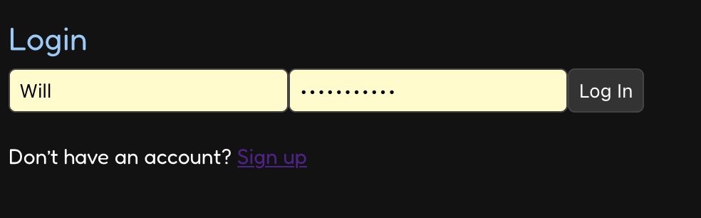
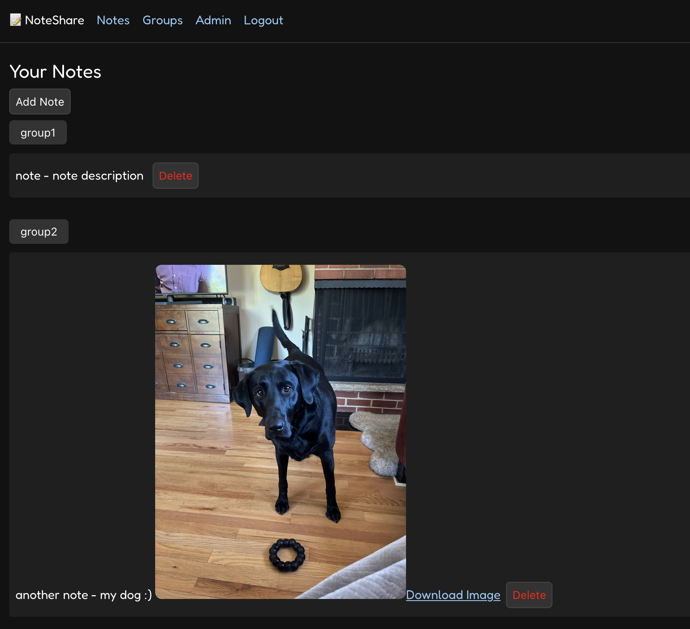
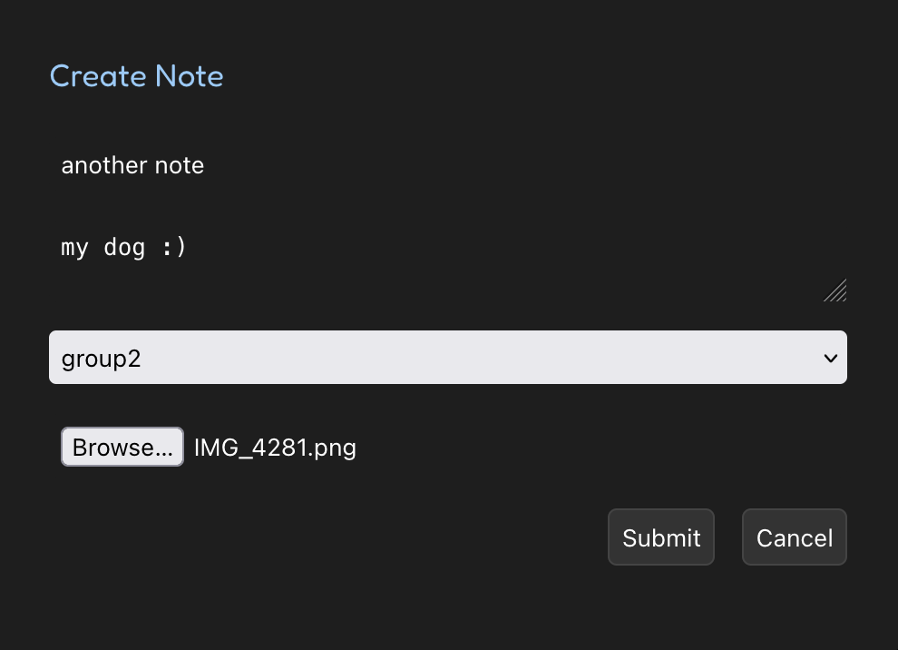
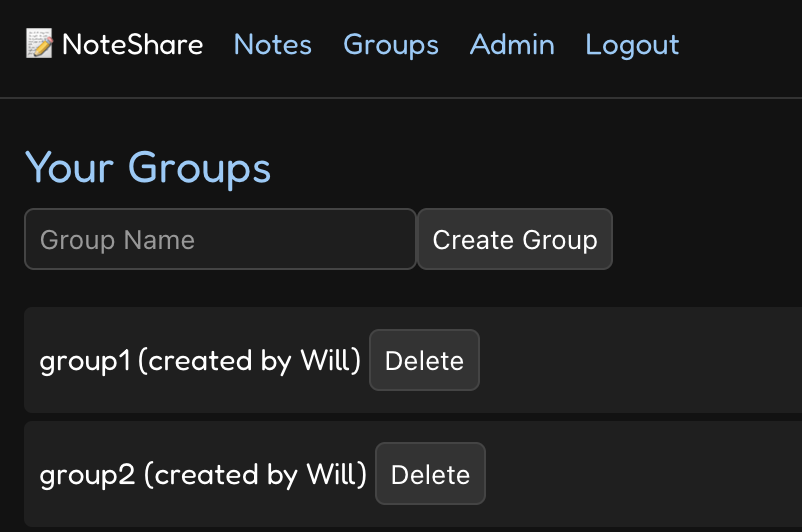
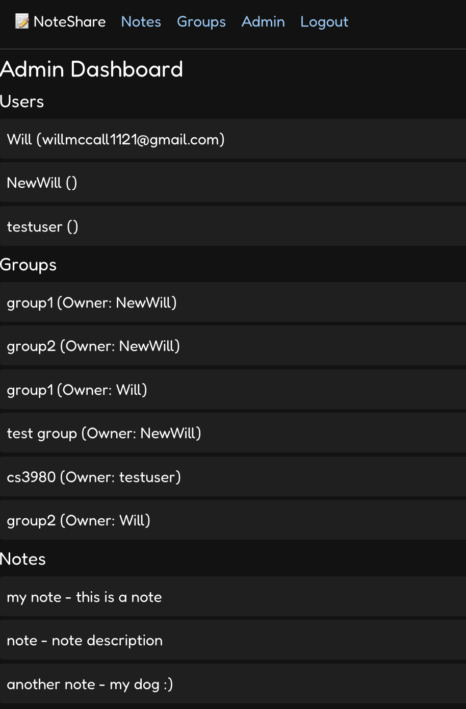
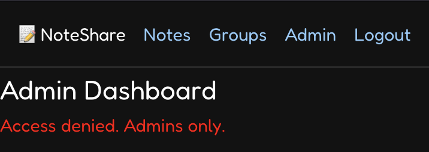
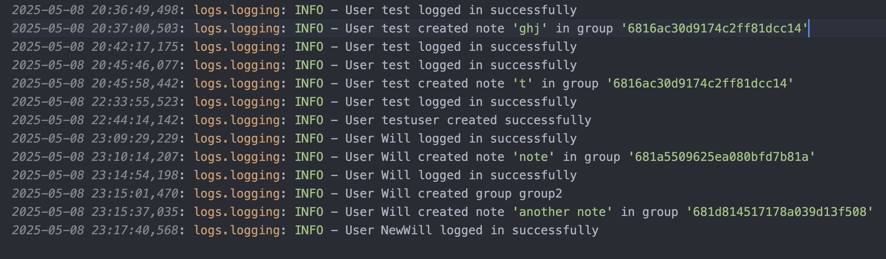
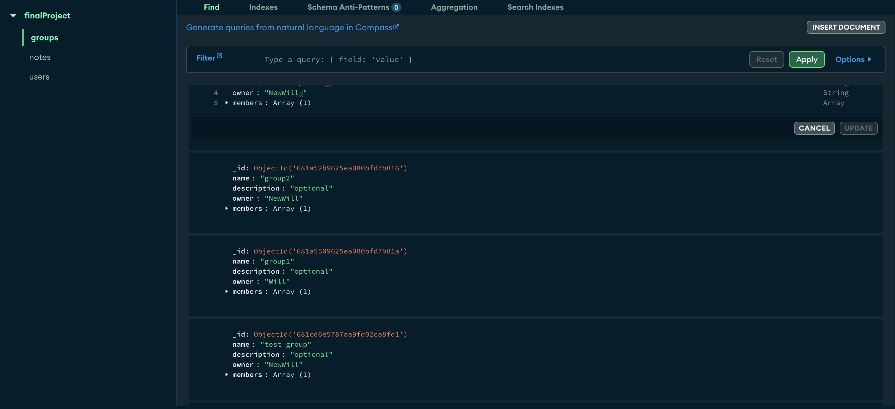
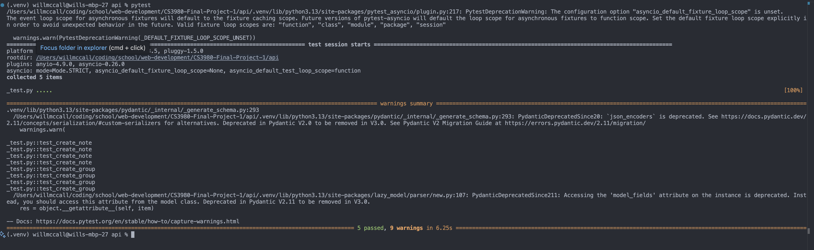

# CS3980 Final Project

## Project Overview

This project is a full-stack web application that allows users to create and manage personal notes and groups. It includes user authentication, an admin interface, and detailed logging. The back end is powered by **FastAPI**, and the front end is built with **Vue**.

## Features

* User authentication (sign up, login)
* Create and delete notes
* Organize notes into groups
* Admin dashboard for viewing all info
* Data persistence with MongoDB
* Logging of application events
* Automated testing suite

## Screenshots

### Signup Page

### Login Page

### Notes Page

### Create Note Page

### Groups Page

### Admin Page

### Admin Access Denied Page

### Logs Page

### MongoDB Database

### Tests

## Technologies Used

* **Front end**: Vue, HTML, CSS, JavaScript
* **Back end**: Python, FastAPI
* **Database**: MongoDB
* **Testing**: pytest

## Installation

1. Clone the repository:
   git clone [<repository-url>](https://github.com/EAlmonrode/CS3980-Final-Project-1)
   
2. Install dependencies:
   pip install -r requirements.txt
   npm install
   
4. Start the development server:
   python main.py
   npm run dev

## Project Structure
├── backend/
├── frontend/
├── images/
├── README.md
├── package.json
└── package-lock.json

## Logging

* All application logs are stored in the /logs directory.
* Logs include server events, API calls, and error traces.

## Testing

* Automated tests are included to ensure reliability of core features.
* To run tests:
  cd api
  pytest

* Application structure
* API interactions
* Data persistence
* Admin capabilities

---

**Author**: Ethan Almonrode, Will McCall
**Course**: CS3980 Final Project
